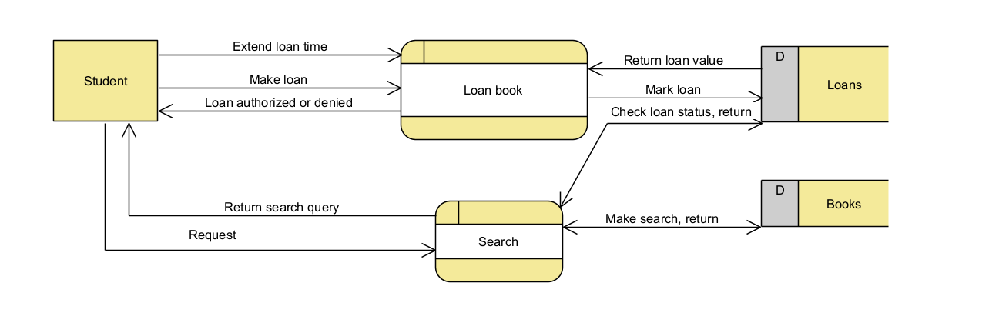

# Assignment 2

## Study of available Software Design tools

### 1 General overview/study
Draw.io is one good web application for drawing different kinds of flow charts. I've personally used it for many different projects in school, like for database design. It's really flexible and easy to use.
Creately is a tool I found online. All the data is presented as "items" that can be managed, moved, grouped and used creatively. So no spreadsheets or tables restricting your workflow.
Visual Paradigm is really advanced looking piece of software. It has quite an expensive pricing model, but it comes with several tools to help with designing. For example, it has user storys, UX tools, REST API designer, diagrams, task management, analysis canvases and so on and so on. The program is cleary designed to be a jack of all trades for advanced uses on software designing. 

### 2 JAMK Library project on Visual Paradigm
I chose Visual Paradigm for the project tool as it seemed vast in terms of features and like professional tool overall. It offers 30-day free trial which I downloaded for use.

Data flow diagram 

Entity relation diagram 

HIPO diagram  

